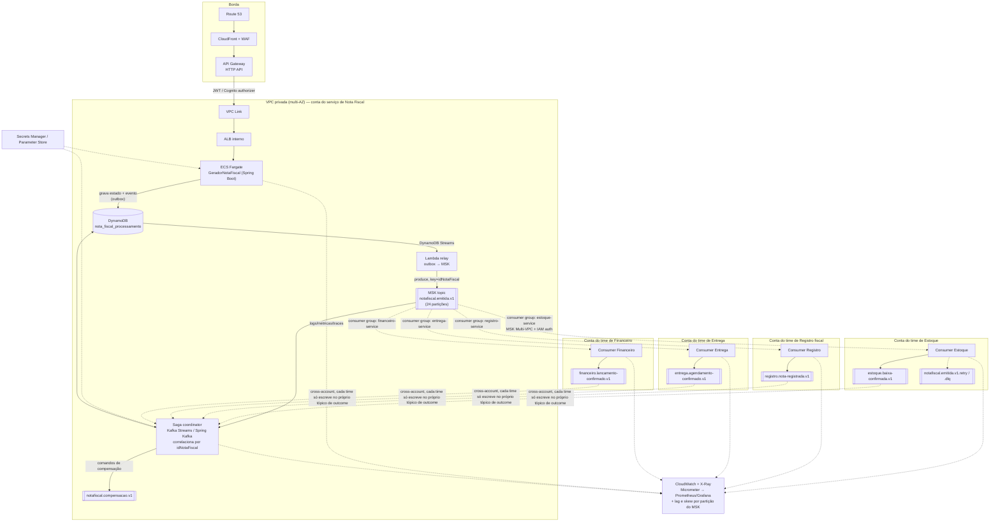
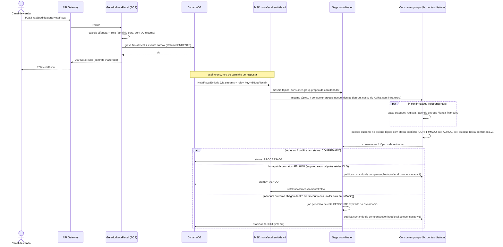

# RFC-0001 — Arquitetura produtiva na AWS para o serviço de Nota Fiscal

## Status

Proposto.

> **Nota de revisão**: a escolha de backbone de eventos mudou de EventBridge + SQS para **Kafka/MSK**. Em uma empresa de grande porte é mais plausível que os domínios downstream (Estoque, Registro, Entrega, Financeiro) pertençam a times distintos — cada um com ownership e, consequentemente, conta AWS próprios — do que a um único time interno; nesse cenário multi-domínio/multi-conta, Kafka/MSK como backbone padronizado entre domínios é a escolha mais coerente (ver seção "Alternativas consideradas e descartadas" e [ADR-0001](../adr/ADR-0001-notificacoes-assincronas-saga-orquestrada.md)). O restante do desenho (separar cálculo síncrono de notificações assíncronas, Saga orquestrada, outbox) não muda.

## Contexto

O serviço, descrito em [`VISAO-DE-NEGOCIO.md`](../VISAO-DE-NEGOCIO.md), recebe um `Pedido` já fechado e:

1. calcula a alíquota de imposto por item (regra depende de tipo de pessoa / regime tributário / faixa de valor);
2. calcula o frete com acréscimo regional;
3. monta a `NotaFiscal` e a devolve ao chamador;
4. **avisa quatro sistemas/áreas da empresa** de que a venda aconteceu: Estoque (baixa), Registro fiscal/contábil, Entrega/logística (agendamento) e Financeiro (contas a receber).

Hoje o passo 4 é implementado em `GeradorNotaFiscalServiceImpl.gerarNotaFiscal` como quatro chamadas **síncronas, sequenciais, bloqueantes**, cada uma instanciando o serviço com `new` (não são beans, não passam por porta de saída):

```java
new EstoqueService().enviarNotaFiscalParaBaixaEstoque(notaFiscal);
new RegistroService().registrarNotaFiscal(notaFiscal);
new EntregaService().agendarEntrega(notaFiscal);
new FinanceiroService().enviarNotaFiscalParaContasReceber(notaFiscal);
```

Cada uma simula a latência de uma chamada real (`Thread.sleep`): Estoque 380ms, Registro 500ms, Entrega 150ms + 200ms (mais um bug de +5s quando a nota tem mais de 5 itens, em `EntregaIntegrationPort`), Financeiro 250ms. Somadas e sequenciais, isso já custa ~1,3s por requisição no caminho feliz, e ~6,3s no caso de bug de >5 itens — e qualquer uma dessas quatro integrações ficando lenta ou fora do ar **trava a resposta HTTP inteira**, mesmo que o cálculo fiscal (a parte que realmente define o contrato da API) tenha sido concluído instantaneamente.

Este RFC propõe a arquitetura de deployment produtivo na AWS para este serviço, com foco especial em resolver esse acoplamento síncrono entre "calcular a nota" e "avisar o resto da empresa", usando um desenho orientado a eventos com compensação via Saga.

### Restrições que esta proposta respeita

- O contrato JSON de entrada (`Pedido`) e saída (`NotaFiscal`) do endpoint `POST /api/pedido/gerarNotaFiscal` **não muda de formato** (ver `README.md` e `CLAUDE.md`). Qualquer informação nova (ex.: status de processamento downstream) é exposta por um recurso adicional, nunca por alteração dos DTOs existentes.
- As latências simuladas representam chamadas reais e **não devem ser removidas** — a proposta as move de lugar (do caminho síncrono da requisição para consumidores assíncronos), não as elimina.
- A aplicação deve continuar rodando localmente sem depender de recursos AWS reais (perfil `local` com adapters em memória/stub).

## Decisão em uma frase

**Separar duas responsabilidades que hoje estão fundidas na mesma chamada HTTP: (1) calcular e devolver a nota fiscal — que é rápido, determinístico e não depende de sistemas externos — e (2) avisar estoque/registro/entrega/financeiro — que são efeitos colaterais em sistemas de terceiros, devem ser assíncronos, e precisam de uma estratégia de compensação (Saga) quando um deles falha depois que os outros já confirmaram.**

Ver detalhamento da decisão específica em [ADR-0001](../adr/ADR-0001-notificacoes-assincronas-saga-orquestrada.md). Este RFC cobre o desenho de arquitetura completo em que essa decisão se encaixa.

## Visão de componentes (AWS)



### Por que cada peça

| Peça | Papel | Por quê |
|---|---|---|
| CloudFront + WAF | Borda pública | Mitigação de DDoS/L7, cache não se aplica (POST), regras de rate-limit por IP/rota |
| API Gateway (HTTP API) | Entrada única, autenticação | Throttling, validação de payload, autorizer JWT (Cognito ou IdP corporativo via OIDC) — resolve o item "hoje sem nenhuma proteção" |
| ECS Fargate (multi-AZ) | Roda o `GeradorNotaFiscalServiceImpl` | Sem servidor para gerenciar, autoscaling por CPU/RPS, rolling/blue-green deploy; alternativa é EKS se a empresa já padronizar em Kubernetes |
| DynamoDB `nota_fiscal_processamento` | Estado por `idNotaFiscal` (outbox + status) | Acesso é por chave única (`idNotaFiscal`), padrão ideal para DynamoDB; vira também a fonte de auditoria de "quais das 4 áreas confirmaram" — hoje isso não existe (sem persistência) |
| DynamoDB Streams + Lambda relay | Publica evento de forma confiável | Implementa o **padrão Transactional Outbox**: grava estado e evento no mesmo `PutItem`, e só depois o relay publica no tópico Kafka — evita perder eventos se o `ECS` cair entre calcular a nota e publicar |
| Amazon MSK — tópico `notafiscal.emitida.v1` | Backbone de eventos de domínio, compartilhado entre times | Em uma empresa de grande porte, é mais plausível que Estoque/Registro/Entrega/Financeiro sejam domínios de negócio com ownership e conta AWS próprios do que consumidores internos de um único time — cenário em que um backbone padronizado entre domínios (Kafka/MSK) é mais coerente do que um backbone dedicado só a este serviço. Chave de partição = `idNotaFiscal` (ver seção "Estratégia de particionamento") |
| Schema Registry (AWS Glue Schema Registry) | Contrato de evento versionado entre times | 4+ times consumidores não coordenam deploy com o produtor; compatibilidade `BACKWARD` obrigatória antes de aceitar um novo schema no tópico |
| MSK Multi-VPC connectivity + IAM auth (`AWS_MSK_IAM`) | Conectividade e autorização cross-account | Cada conta consumidora conecta via seu próprio ENI, sem expor a VPC inteira; ACL por tópico restringe quem produz (só o serviço de Nota Fiscal em `notafiscal.*`) e quem consome/publica em cada tópico de outcome |
| Consumer groups (4x, um por time, cada em sua conta) | Adaptadores de saída (hexagonal) | Substituem os `new EstoqueService()` etc. por consumidores Kafka independentes, escaláveis e com retry/DLQ próprios via tópicos `.retry`/`.dlq` (Spring Kafka `@RetryableTopic`) |
| Saga coordinator (Kafka Streams / Spring Kafka + state store) | Orquestrador da Saga | Consome os 4 tópicos de outcome, correlaciona por `idNotaFiscal`, decide sucesso/compensação — papel que antes seria do Step Functions, agora nativo do mesmo backbone de eventos, sem misturar dois brokers para a mesma transação |
| Secrets Manager / Parameter Store | Config e credenciais por ambiente | Sem hardcode, resolve o requisito de configuração por ambiente de SPEC-05 |
| CloudWatch + X-Ray + Micrometer + métricas MSK | Observabilidade | Rastreamento distribuído fim a fim por `idNotaFiscal`, mais lag por consumer group e bytes-in/messages-in por partição — essencial para detectar hot partitions em produção |

## Estratégia de particionamento (evitando hot partitions)

O tópico `notafiscal.emitida.v1` é lido por quatro consumer groups independentes, cada um em uma conta diferente — o desenho só funciona bem em produção se o tráfego se distribuir uniformemente entre as partições. Regras adotadas:

- **Nunca particionar por `Regiao`, `TipoPessoa` ou `RegimeTributacaoPJ`**: são enums de cardinalidade muito baixa (5, 2 e 4 valores respectivamente). Particionar por qualquer um deles garantiria que poucas partições concentrem todo o tráfego, independente do volume total — o erro mais provável ao se escolher uma chave "de negócio" sem olhar a cardinalidade real do campo.
- **Não usar `Documento.numero` (CPF/CNPJ) como chave do tópico principal**: mesmo com boa cardinalidade agregada, um único cliente PJ com volume desproporcional de pedidos concentraria uma fração desproporcional do tráfego em uma única partição (problema de "celebrity key").
- **Chave escolhida: `idNotaFiscal`** (UUID gerado por evento) — cardinalidade máxima, distribuição uniforme por natureza. Cada nota fiscal é processada de forma independente pelos quatro consumidores; não há requisito de ordenação entre notas de pedidos diferentes, então distribuir por evento é estritamente melhor do que agrupar por cliente. `idPedido` viaja no payload/headers como campo de correlação, não como chave de partição.
- **Ordenação por cliente, se algum consumidor precisar**: fica a cargo daquele consumidor específico (ex.: Financeiro serializando lançamentos do mesmo CNPJ via sua própria repartição/state store dimensionada para sua concorrência), em vez de forçar o tópico compartilhado — usado pelos outros três consumidores sem essa necessidade — a particionar por CNPJ.
- **Salting como último recurso**: se uma chave realmente concentrar tráfego de forma inevitável, aplicar sufixo de bucket (`chave#hash%N`) para espalhar uma chave lógica "quente" entre N partições, aceitando reordenação limitada ou reagregando no consumidor.
- **Dimensionamento**: partições ≥ maior paralelismo de consumo esperado por qualquer um dos quatro consumer groups (ponto de partida: 12–24 partições), evitando over-partitioning — cada partição tem custo de réplica e file handles no broker, e aumentar partições depois é disruptivo (redistribui chaves).
- **Configuração do produtor**: `enable.idempotence=true`, `acks=all`, sempre com chave explícita (nunca produzir com `key=null`, que distribuiria por round-robin/sticky sem controle determinístico por nota).
- **Monitoramento**: acompanhar bytes-in/messages-in por partição (CloudWatch MSK ou Kafka Lag Exporter) e alertar quando uma partição exceder ~2x a média — cobre concentração real de tráfego que o desenho teórico não prevê (ex.: um cliente grande de fato dominando o volume).

## Fluxo de requisição



O chamador recebe a `NotaFiscal` assim que o cálculo fiscal termina — não espera nenhuma das quatro integrações. Para saber se a venda foi "processada de ponta a ponta" (conceito explícito na visão de negócio), a proposta expõe um recurso **adicional** (não altera o contrato existente):

```
GET /api/pedido/{idNotaFiscal}/status
→ { "idNotaFiscal": "...", "status": "PENDENTE|PROCESSADA|FALHOU", "confirmacoes": {...} }
```

## Contrato de outcome, falha e timeout da Saga

O Saga coordinator só decide sucesso/compensação corretamente se tiver um sinal claro de cada um dos 4 domínios — não pode depender do silêncio de quem nunca respondeu. Dois contratos precisam existir além do "publica outcome quando dá certo" descrito acima:

**Outcome com status explícito (sucesso e falha)**

Cada consumidor (Estoque/Registro/Entrega/Financeiro) publica no seu próprio tópico de outcome (`estoque.baixa-confirmada.v1`, etc.) um evento com um campo `status`, não só o caminho feliz:

```json
{ "idNotaFiscal": "...", "dominio": "estoque", "status": "CONFIRMADO|FALHOU", "motivo": "...", "timestamp": "..." }
```

O consumidor decide internamente quando desistir — esgotou os hops do seu próprio tópico `.retry`, caiu no `.dlq` — e é responsabilidade dele, não do Saga coordinator, publicar `FALHOU` nesse canal. Isso preserva a fronteira de ownership entre domínios: o coordinator nunca precisa inspecionar o `.dlq` interno de outro time, apenas o contrato de outcome que esse time já expõe.

**Timeout para sagas que nunca fecham**

Sem Step Functions não há timeout declarativo pronto. Se um consumidor cair silenciosamente sem nunca publicar `CONFIRMADO` nem `FALHOU`, a saga ficaria pendente para sempre. Mitigação: um job periódico (scheduled task no próprio Saga coordinator, ou uma Lambda agendada) varre o DynamoDB por registros `status=PENDENTE` mais antigos que um limite (ex.: 5 minutos — folga generosa sobre a soma das latências simuladas), trata a ausência de outcome como falha e aciona compensação + alerta operacional. Esse limite também é candidato a métrica de observabilidade ("sagas presas por timeout").

## Por que orientado a eventos, e por que Saga (não só paralelizar)

Uma alternativa mais simples — e que também resolve boa parte do problema de performance relatado no desafio — seria manter as quatro chamadas síncronas, mas disparadas em paralelo (`CompletableFuture`/virtual threads) dentro da própria requisição. Vale comparar as três opções:

| Opção | Latência da resposta | Acoplamento de disponibilidade | Consistência | Complexidade operacional |
|---|---|---|---|---|
| **Atual**: síncrono sequencial | soma das 4 (~1,3s, ou ~6,3s com bug >5 itens) | resposta cai se qualquer uma das 4 cair | forte, mas frágil (uma exceção no meio derruba a nota já calculada) | baixa |
| Síncrono paralelo | max das 4 (~500ms) | resposta ainda cai se qualquer uma das 4 cair ou ficar lenta | forte | baixa |
| **Proposto**: orientado a eventos + Saga | tempo do cálculo fiscal (~dezenas de ms) | resposta não depende de nenhuma das 4 integrações | eventual, com compensação explícita | mais alta (MSK/Kafka, Schema Registry, Saga coordinator, DynamoDB) |

A paralelização é uma melhoria real e de baixo custo (entregue em SPEC-03 como ganho de curto prazo), mas não resolve o problema estrutural: a API de emissão de nota continua **acoplada em disponibilidade** a quatro sistemas de terceiros que não têm relação com o cálculo fiscal em si. Um outage no sistema de Entrega, por exemplo, não deveria impedir a emissão da nota fiscal.

O motivo para ir além da paralelização e adotar **event-driven + Saga**, e não apenas "disparar e esquecer" (fire-and-forget sem coordenação), é que a própria visão de negócio define a emissão como uma transação de negócio que atravessa quatro sistemas independentes ("uma venda só está processada de ponta a ponta quando as quatro confirmações acontecem"). Isso é exatamente o cenário clássico de **Saga**: não existe transação distribuída (2PC) viável entre Estoque, Registro, Entrega e Financeiro, então a consistência é obtida por eventual consistency + compensação quando uma etapa falha depois que outras já tiveram sucesso (ex.: baixa de estoque confirmada, mas o lançamento financeiro falha definitivamente — é preciso estornar a baixa de estoque).

**Orquestração (Saga coordinator Kafka-nativo) em vez de coreografia pura** foi escolhida porque:

- As quatro confirmações são paralelas e independentes entre si (não há uma sequência de dependência de negócio entre elas), então o valor da orquestração aqui não é ordenar passos, e sim ter **um único lugar que sabe o estado agregado** ("quantas das 4 confirmaram, qual falhou") — em coreografia pura isso ficaria implícito, espalhado entre consumidores, exigindo um agregador à parte de qualquer forma.
- Domínio fiscal/contábil valoriza **trilha de auditoria**: o estado que o Saga coordinator persiste no DynamoDB por `idNotaFiscal` (quem confirmou, quando, o que foi compensado) é a fonte de auditoria, o que hoje inexiste (a aplicação não persiste nada).
- O coordenador concentra retry/timeout/decisão de compensação em um único componente, reduzindo código de coordenação espalhado pelos consumidores — sem depender de uma ferramenta gerenciada externa ao backbone de eventos (evitando misturar Kafka com Step Functions para a mesma transação).

O custo é complexidade operacional adicional — mais peças para monitorar, alarmes de consumer lag e de skew de partição, runbook de "saga presa". Isso é proporcional ao ganho (desacoplamento de disponibilidade + auditoria + correção do bug de performance na raiz), mas é importante registrar que é um trade-off deliberado, não gratuito.

## Idempotência

`idNotaFiscal` (já gerado como UUID hoje) é a chave natural de idempotência em toda a cadeia e também a **chave de partição** do tópico `notafiscal.emitida.v1` (ver "Estratégia de particionamento"): chave do item no DynamoDB, chave de partição no evento Kafka, e chave de negócio que cada consumidor usa para checar "já processei essa nota?" antes de aplicar o efeito (baixa de estoque, lançamento financeiro etc.). O produtor roda com `enable.idempotence=true` e `acks=all` para evitar duplicar o evento em retries de rede na publicação, mas isso não elimina a necessidade de dedupe no consumidor: Kafka entrega *at-least-once* ponta a ponta com sistemas externos (não há exactly-once fora do próprio cluster), e retries de consumo ou da Saga podem reexecutar uma etapa.

## Caminho de migração incremental

Não é um corte único. Ordem sugerida, compatível com os planos de execução de `docs/sdd/specs/`:

1. Extrair as quatro chamadas para *driven ports* (hexagonal) — pré-requisito para trocar o adapter síncrono por um publisher de evento sem tocar no domínio. **Entregue em [SPEC-03](../sdd/specs/SPEC-03-nucleo-alvo.md)**; ver o mapeamento porta→AWS abaixo.
2. Paralelizar as chamadas síncronas atuais (virtual threads) como ganho imediato de performance — já resolve o sintoma de latência enquanto a infraestrutura de eventos é construída. **Entregue em [SPEC-03](../sdd/specs/SPEC-03-nucleo-alvo.md)**.
3. Introduzir o outbox (DynamoDB) e publicar o evento `NotaFiscalEmitida` no tópico MSK `notafiscal.emitida.v1` (com a chave de partição `idNotaFiscal` definida desde o início — trocar chave de partição depois de haver tráfego real é disruptivo) **mantendo** as chamadas síncronas atuais em paralelo, para validar consumidores novos sem risco (dupla escrita temporária).
4. Migrar os quatro consumidores para consumer groups Kafka assíncronos (cada um na conta do time correspondente, via MSK Multi-VPC + IAM auth), remover as chamadas síncronas, expor `GET /status`.
5. Introduzir o Saga coordinator (Kafka-nativo) com as compensações reais assim que houver clareza de qual ação de estorno cada sistema downstream expõe (isso depende de contrato com os times donos de Estoque/Registro/Entrega/Financeiro, fora do controle deste serviço) — inclui negociar com cada time o ACL/IAM de acesso ao tópico principal e o tópico de outcome que cada um publicará.

## Mapeamento hexagonal: portas e adaptadores → componentes AWS

A arquitetura hexagonal entregue em [SPEC-03](../sdd/specs/SPEC-03-nucleo-alvo.md) é o que torna esta migração possível sem tocar no domínio. Os nomes abaixo são os reais, implementados no código — não placeholders:

| Porta (SPEC-03) | Adaptador entregue (síncrono) | Destino produtivo | Componente AWS |
|---|---|---|---|
| `GerarNotaFiscalUseCase` (entrada) | `GeradorNFController` | inalterado — adaptador web fino | API Gateway → VPC Link → ALB interno → ECS Fargate |
| `EstoqueNotificacaoPort` | `EstoqueAdapter` (380ms) | consumer group na conta do time de Estoque | tópico `notafiscal.emitida.v1` / grupo `estoque-service` |
| `RegistroNotificacaoPort` | `RegistroAdapter` (500ms) | consumer group na conta do time de Registro | `notafiscal.emitida.v1` / `registro-service` |
| `EntregaNotificacaoPort` + `EntregaIntegrationPort` | `EntregaAdapter` + `EntregaIntegrationAdapter` (150ms + 200ms) | consumer group na conta do time de Entrega; a chamada à API externa de agendamento passa a ser interna ao consumidor | `notafiscal.emitida.v1` / `entrega-service` |
| `FinanceiroNotificacaoPort` | `FinanceiroAdapter` (250ms) | consumer group na conta do time de Financeiro | `notafiscal.emitida.v1` / `financeiro-service` |
| `domain/aliquota`, `domain/frete` | in-process, plain Java, sem I/O | inalterado | roda dentro do processo ECS, sem componente próprio |

A leitura que importa: **as quatro portas de saída não viram quatro adaptadores Kafka.** Elas convergem para **um único** adaptador de publicação (outbox → `notafiscal.emitida.v1`), e o que hoje é "uma porta por sistema notificado" passa a ser "um consumer group por time", do outro lado do backbone. É exatamente o passo 3→4 do caminho de migração acima. O ganho das portas não é haver uma por destino — é que a troca de um adapter síncrono por um publisher não alcança `domain/` nem `GerarNotaFiscalService`.

## Demais aspectos da arquitetura produtiva

- **Autenticação/autorização**: API Gateway com autorizer JWT validando tokens emitidos por Cognito (ou IdP corporativo via OIDC); IAM roles com least-privilege por task/lambda (task role distinta da execution role).
- **Rede/segurança**: ECS e o Saga coordinator em subnets privadas; MSK Multi-VPC connectivity (ou VPC endpoints/PrivateLink para DynamoDB e Secrets Manager) evitando tráfego AWS-to-AWS pela internet e expor a VPC inteira às contas consumidoras; NAT Gateway só para egress a integrações externas reais; security groups por componente e ACL por tópico Kafka; criptografia em repouso (KMS) e em trânsito (TLS) em todas as peças.
- **Escalabilidade/HA**: multi-AZ em ECS, DynamoDB e no cluster MSK por padrão; autoscaling do ECS por CPU/RPS; cada consumer group escala de forma independente por conta, limitado pelo número de partições do tópico (ver "Estratégia de particionamento").
- **Resiliência**: Resilience4j (retry/circuit breaker/bulkhead) dentro dos consumidores para chamadas HTTP reais às integrações externas, complementando (não substituindo) o retry via tópicos `.retry`/`.dlq` (Spring Kafka `@RetryableTopic`) — Kafka não tem delay nativo por mensagem como o SQS; job periódico de timeout no Saga coordinator para sagas sem outcome de algum domínio (ver "Contrato de outcome, falha e timeout da Saga"); alarmes de consumer lag por grupo e de skew entre partições (candidato a hot partition).
- **Observabilidade**: Micrometer exportando para CloudWatch/Prometheus+Grafana; X-Ray para tracing distribuído fim a fim por `idNotaFiscal`; métricas de lag por consumer group e bytes-in/messages-in por partição do MSK; health checks `/actuator/health/{liveness,readiness}` ligados ao target group do ALB, expostos em porta de management separada e alcançável apenas pelo security group do ALB e do scraper (ver [SPEC-05](../sdd/specs/SPEC-05-observabilidade-e-configuracao.md)).
- **Persistência**: DynamoDB é a única persistência necessária para este desenho (estado de processamento); não há necessidade de RDS relacional a menos que surjam requisitos de relatório/BI sobre notas emitidas.

## Consequências

**Positivas**: resposta da API deixa de depender da disponibilidade de quatro sistemas de terceiros; corrige a causa raiz do problema de performance (não só o sintoma dos >6 itens); cada integração escala e falha de forma independente; ganha-se trilha de auditoria de processamento que hoje não existe.

**Negativas**: sistema passa a ser eventualmente consistente — é preciso comunicar falhas tardias ao canal de venda (endpoint de status, webhook ou evento que o canal assine); mais peças de infraestrutura para operar (cluster/tópicos MSK, Schema Registry, ACLs cross-account, Saga coordinator, DynamoDB) do que o monólito atual; compensações podem falhar e exigem intervenção manual (fila/alerta dedicados); exige tracing distribuído que não era necessário antes; exige disciplina de particionamento (chave e contagem de partições) desde o início, já que corrigir hot partitions depois de haver tráfego real é disruptivo.

## Alternativas consideradas e descartadas

- **Manter tudo síncrono, só paralelizar**: resolve performance, não resolve acoplamento de disponibilidade nem dá trilha de auditoria. Tratado como *estado intermediário* no caminho de migração, não como destino final.
- **Coreografia pura (sem orquestrador)**: cada worker publica seu próprio evento de sucesso/falha e um serviço à parte agrega. Descartado como principal porque acabaria recriando, de forma implícita e espalhada, o mesmo agregador de estado que o Saga coordinator já oferece pronto, com pior auditabilidade.
- **Fire-and-forget sem Saga**: publicar o evento e nunca verificar se as 4 confirmaram. Descartado porque contraria a visão de negócio, que trata as 4 confirmações como parte da definição de "venda processada".
- **EventBridge + SQS (uma fila por consumidor) como backbone, em vez de Kafka/MSK**: foi a escolha original deste RFC, sob a premissa de que o cenário tinha "4 consumidores internos fixos e conhecidos" — exatamente o shape que fila (SQS) + DLQ por consumidor resolve nativamente, sem a sobrecarga operacional de um cluster Kafka (partições, consumer groups, rebalanceamento, sizing de broker). Essa premissa não é realista em uma empresa de grande porte: é muito mais plausível que Estoque, Registro, Entrega e Financeiro sejam **domínios de negócio com ownership próprio** — times e, consequentemente, contas AWS distintas — do que consumidores internos de um único time. Nesse cenário multi-domínio/multi-conta, EventBridge+SQS obrigaria cada domínio a integrar com um backbone específico deste serviço, enquanto Kafka/MSK é o padrão mais coerente para múltiplos domínios independentes trocando eventos entre contas, reaproveitando práticas (particionamento, schema registry, monitoramento) já estabelecidas para esse tipo de topologia. Descartado como escolha final em favor de Kafka/MSK; ver decisão revisada em [ADR-0001](../adr/ADR-0001-notificacoes-assincronas-saga-orquestrada.md) e a seção "Estratégia de particionamento" acima para como este RFC evita hot partitions no desenho com Kafka.
